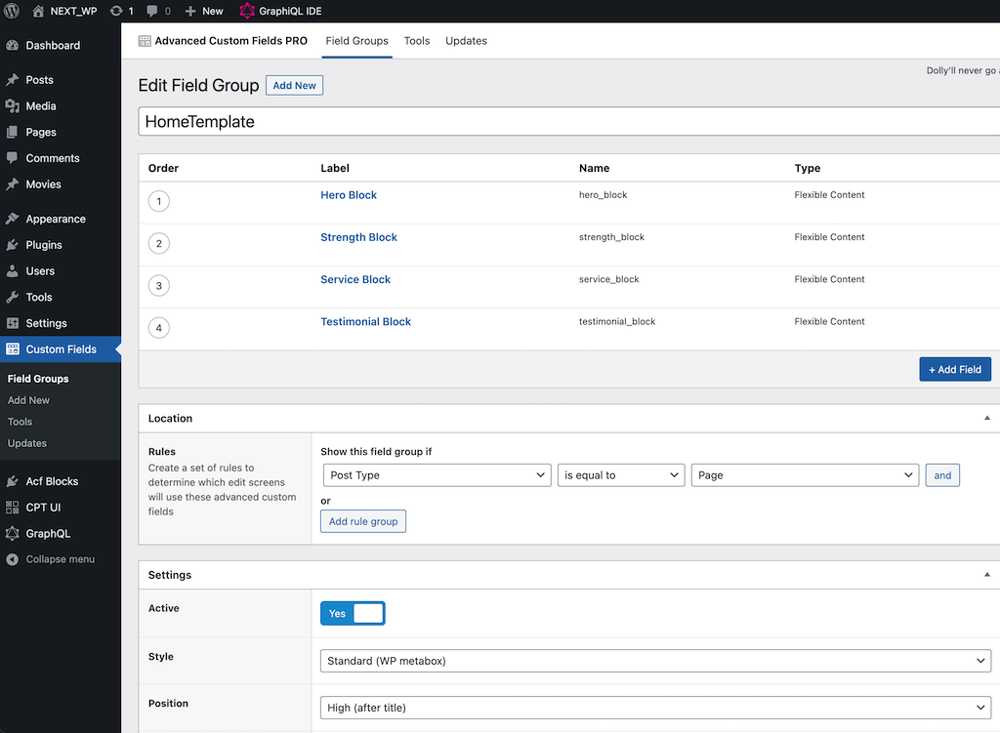
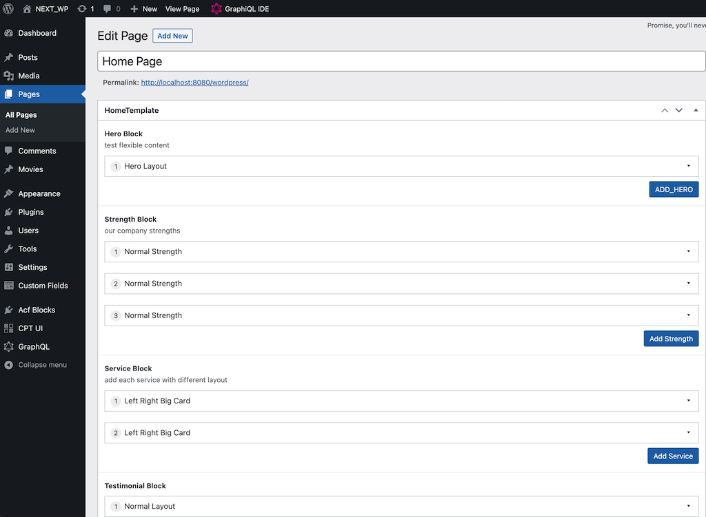

# A Next.js website using Headless WordPress

With the help of WPGraphQL plugin, we could retrieve wordpress pages meta data composed by Advanced Custom Fields, then consume these graphql dataset in Nextjs pages through `getStaticProps` function, injecting retrieved data to page components.

the high level architechture:

- Wordpress, as data store management system
- WPGraphQL plugin, as wordpress api bridge
- Advanced Custom Fields plugin, as wp page meta data composer
- Next.js, as Reactjs app builder

## Usage Scenario

- Brand new project && 
- No backend developers && 
- Reactjs as front-end choice && 
- Limited budget for API service or content storage

## Demo

[Static Wordpress Movies](https://static-wp-movie.vercel.app/)

## Installation

- Wordpress
- MySQL
- Nginx or Apache
- Next.js dev environment

## Required Wordpress plugins:

- [Advanced Custom Fields pro](https://www.advancedcustomfields.com/pro/)
- [WPGraphQL](https://wordpress.org/plugins/wp-graphql/)
- [WPGraphQL for Advanced Custom Fields](https://github.com/wp-graphql/wp-graphql-acf)
- [Custom Post Type UI](https://en-ca.wordpress.org/plugins/custom-post-type-ui/)

## Develop your own Headless Wordpress app

- Step 1: draft UI outline/prototype
- Step 2: create advance custom fields group for wordpress pages
- Step 3: switch wordpress editor to classic(Settings/Writing Settings/Default editor for all users)
- Step 4: create wordpress pages with corresponding custom field group
- Step 5: fill custom fields value attached in wordpress pages
- Step 6: get WPGraphQL API url from `WPGraphQL General Settings/GraphQL Endpoint` in wordpress
- Step 7: copy `.env.local.example` to `.env.local` and fill the value of `WORDPRESS_API_URL`
- Step 8: develop Nextjs pages with graphql data source from wordpress

## Deployment

- build nextjs app by: `yarn build`
- deploy static files under `out` directory

## Screenshots

### ACF group for Home page 

### Home page edit with ACF group

## ACFs Structure tips

- Each Field(named as `XXX Block`) in Field Group select `Flexible Content` for `Field Type`.
- Each Field in Layout using `Table` layout as a recommended value for a compact way.
- Check `Content Editor` in Hide on screen section while edit your Field Group, this will enable your default classic editor hidden in page edit interface, just leave more space for Field group edit.